# 
    THREE TIER INVENTORY APP

#### Description of Project:

I built a containerized three-tier inventory management application using Docker, with a frontend served by Nginx, a backend API with Node.js and Express, and a PostgreSQL database, each running in its own container. Docker Compose is used to orchestrate all services. The project also integrates GitHub Actions for CI/CD, automatically building, scanning with Trivy, and pushing Docker images to Docker Hub, demonstrating knowledge of three-tier architecture, containerization, service communication, and DevOps practices.

---

**Phase1): Folder Structure:**

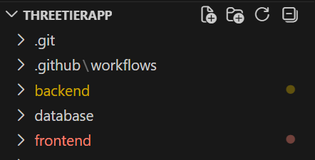

---

**Phase2):DataBase:**

In this project, PostgreSQL was utilized as the database. The first step involved pulling the official PostgreSQL Docker image to set up the database environment

To verify that the PostgreSQL image was successfully pulled, the docker images command was executed, which lists all available Docker images on the system.

**Init.sql**

This SQL script creates a products table with columns for id, name, quantity, and price. The id column is defined as a primary key with auto-increment (SERIAL). The script then inserts sample product records into the table, providing initial data for the inventory management system. These entries serve as test data to verify database connectivity and backend functionality.

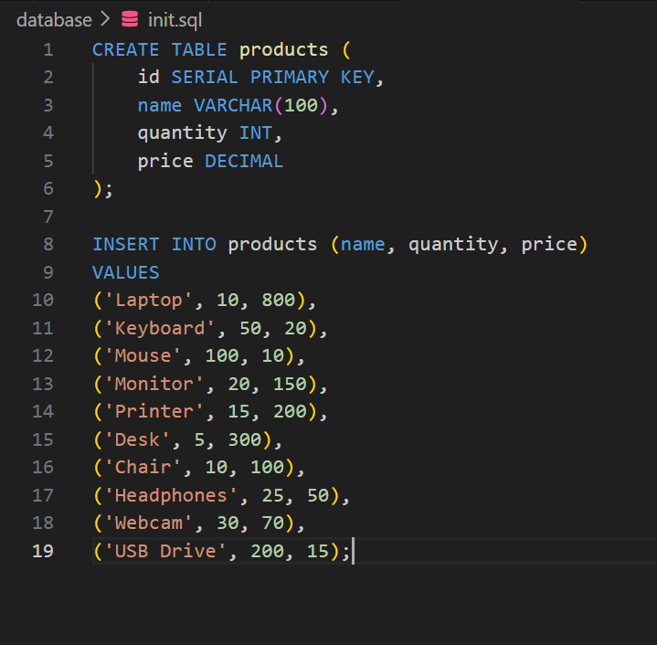

Running the PostgreSQL Container:

* Runs the container in detached mode (-d) with the name inventory-db.
* Sets up PostgreSQL with user inventory_user, password inventory_pass, and database inventory_db.
* Maps the container port 5432 to the host for external access.
* Mounts an initialization SQL script to automatically create tables or seed data.
* Uses the official PostgreSQL  Docker image.

Once the container started successfully, we verified that the database was created and populated correctly using the init.sql script. To do this, we accessed the running container and executed SQL commands to retrieve the records, ensuring that the initialization script had been applied successfully.

---

**Phase3) Networking:**

In this phase, a custom Docker network named inventory-network was created to enable communication between the database and the backend services. By connecting both the PostgreSQL container and the backend container to this network, seamless connectivity was established, allowing the backend to interact with the database securely and efficiently.

---

**Phase 4) :Dockerizing the Backend Application**

Backend/Server.js

This backend uses **Node.js** and **Express** to manage product data in the **PostgreSQL** database.

* **GET /products** – Fetches all products from the database.
* **POST /products** – Adds a new product with name, quantity, and price.
* **Database Connection** – Uses pg Pool to connect to inventory_db in the inventory-network.
* **Server** – Runs on port 3001 and handles JSON requests.

Purpose: Provides API endpoints for the frontend to interact with the database in a containerized environment.

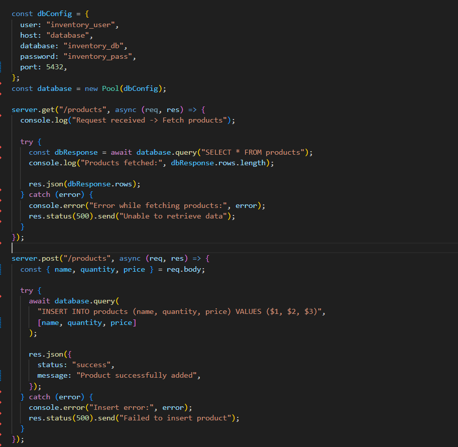

In this phase, the backend application was containerized using Docker to ensure consistency across environments and simplify deployment. A Docker image was built for the backend service, and a container was created and connected to the previously established inventory-network to enable seamless communication with the PostgreSQL database

Dockerfile for Backend:

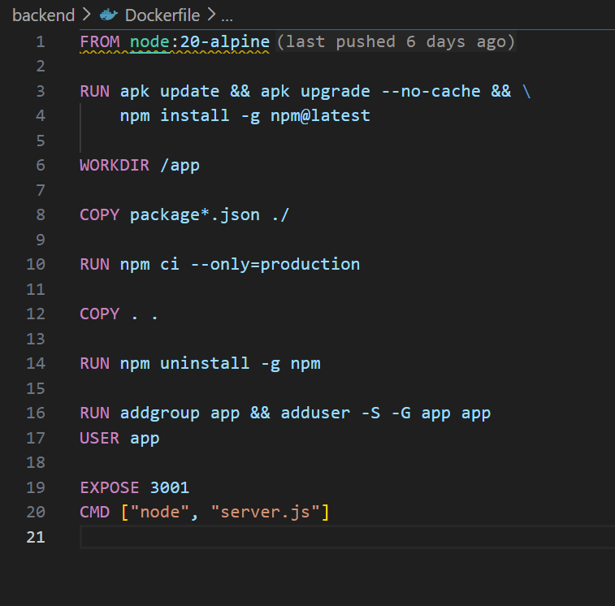

* **FROM node:20-alpine** – Uses the lightweight Node.js 20 Alpine image as the base for the container.
* **RUN apk update && apk upgrade --no-cache && npm install -g npm@latest** – Updates the Alpine package manager, upgrades packages, and installs the latest version of npm globally.
* **WORKDIR /app** – Sets /app as the working directory inside the container.
* **COPY package*.json ./** – Copies package.json and package-lock.json to the working directory for dependency installation.
* **RUN npm ci --only=production** – Installs only production dependencies, ensuring a clean and consistent build.
* **COPY . .** – Copies all remaining application files into the container.
* **RUN npm uninstall -g npm** – Removes the globally installed npm to reduce image size.
* **RUN addgroup app && adduser -S -G app app** – Creates a new user group and a non-root user named app for better security.
* **USER app** – Switches to the app user to run the application as a non-root user.
* **EXPOSE 3001** – Exposes port 3001 for the backend service.
* **CMD ["node", "server.js"]** – Defines the default command to start the backend server.

The backend Docker image was built using the following command:

**Connecting the Backend to the Inventory Network**

To enable communication between the backend and the PostgreSQL database, the backend container was attached to the previously created inventory-network. This ensures that both services can interact seamlessly within the same Docker network, allowing the backend to access the database securely.

With both the database and backend fully containerized, the backend can now communicate with the PostgreSQL container to fetch and manipulate data. To verify this, the backend API endpoint was tested by accessing http://localhost:3001/products. Additionally, the curl command was used in the terminal to programmatically test the API and confirm that the data was being retrieved successfully.

---

**Phase 5: Dockerizing the Frontend**

In this phase, the frontend application was containerized using  **Nginx** . The index.html file was copied into the container, and a lightweight Nginx Alpine image was used to serve the application on port 80. A health check was configured to ensure the container remains healthy and responsive.

Frontend/index.html

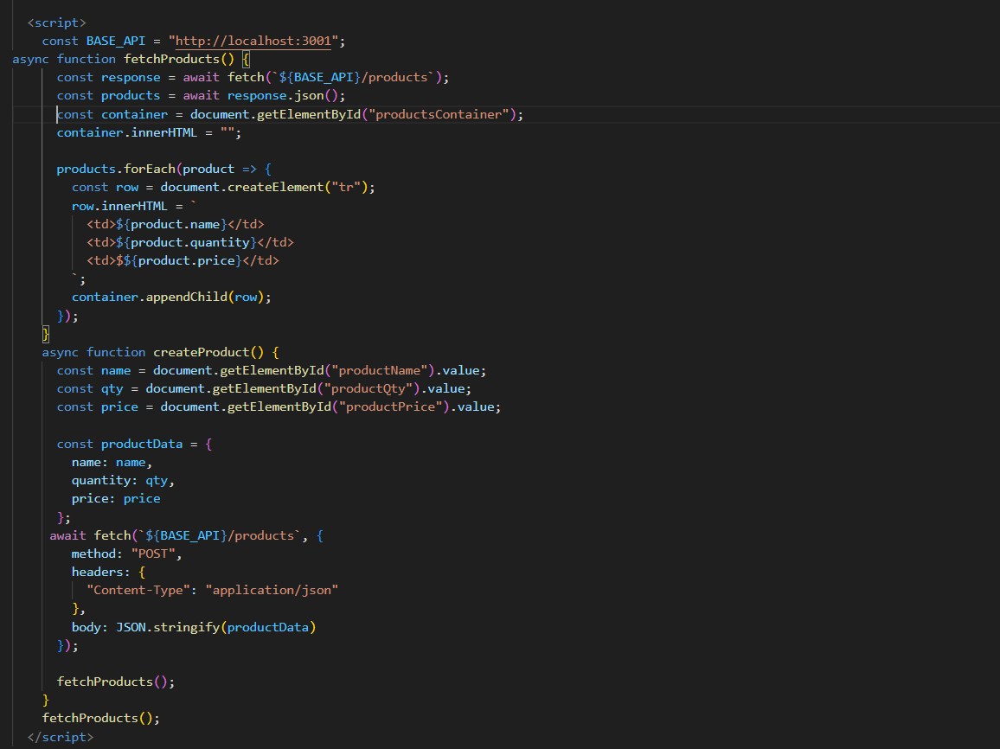

The frontend is a simple **HTML, CSS, and JavaScript** application that interacts with the backend API. It provides a form to add new products and displays the product inventory in a table. The application fetches product data from http://localhost:3001/products and updates the table dynamically whenever a new product is added. The layout uses CSS for styling and animations, ensuring a clean and responsive user interface.

**Dockerfile for frontend**

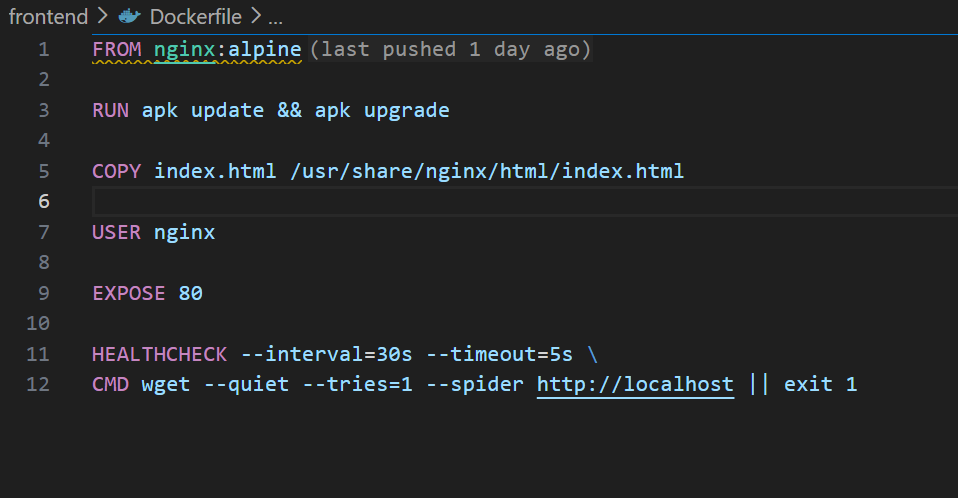

In this phase, the frontend application was containerized using  **Nginx** . The index.html file was copied into the container, and a lightweight Nginx Alpine image was used to serve the application on port 80. A health check was configured to ensure the container remains healthy and responsive.

1. **FROM nginx:alpine** – Uses the lightweight Nginx Alpine image as the base.
2. **RUN apk update && apk upgrade** – Updates and upgrades the container’s packages.
3. **COPY index.html /usr/share/nginx/html/index.html** – Copies the frontend index.html file into the Nginx web server directory.
4. **USER nginx** – Runs Nginx as a non-root user for security.
5. **EXPOSE 80** – Exposes port 80 for HTTP traffic.
6. **HEALTHCHECK** – Periodically checks the container’s health by sending a request to http://localhost every 30 seconds; if the check fails, the container is marked unhealthy.

Bulding the frontend image using the following commands

To make the frontend accessible from the host machine, port **8080** on the host was mapped to port **80** in the Nginx container. This allows the application to be accessed in a browser via http://localhost:8080 while the container serves content on its default HTTP port.

---

**Phase 6) Docker Compose:**

Manually running each container after every change or during debugging can be repetitive and time-consuming. To simplify this process, a **Docker Compose** file was created. This allows all services—the backend, frontend, and database—to be started together using a single docker-compose up command. Docker Compose reduces manual effort, ensures consistent container configuration, and streamlines the application build and deployment process.

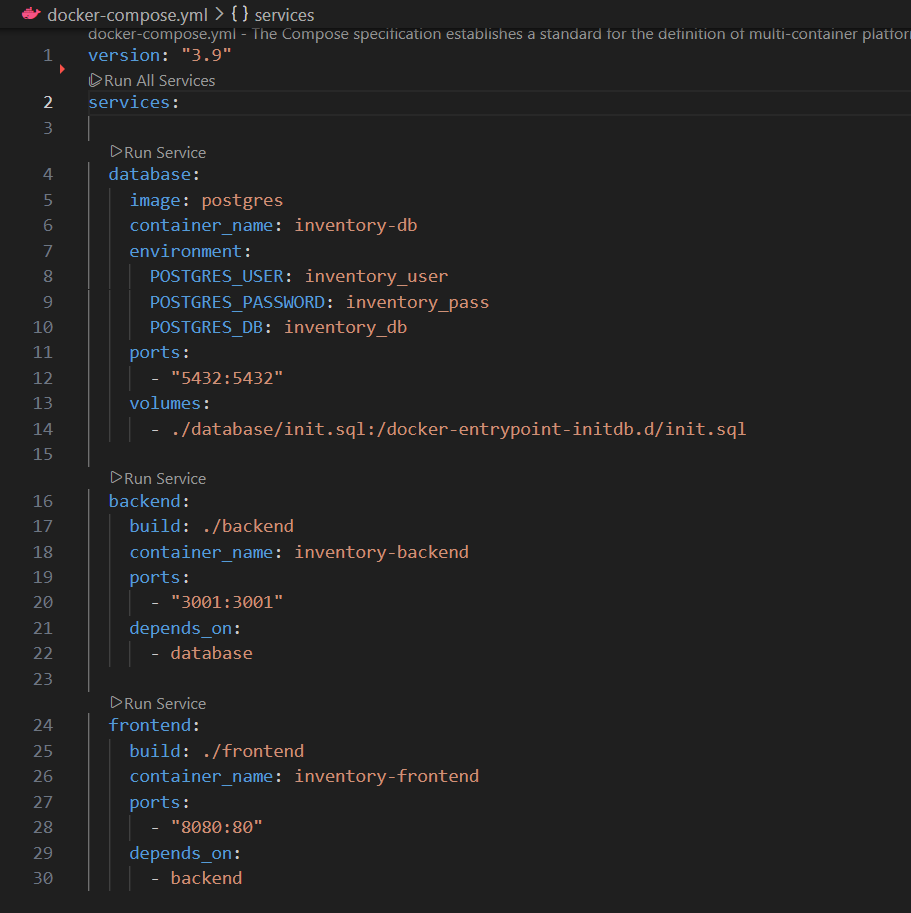

The docker-compose.yml file defines and orchestrates all services required for the inventory management application:

1. **Database Service (database)**
   * Uses the official PostgreSQL image.
   * Configures the database user, password, and default database.
   * Maps port 5432 to the host and mounts an initialization SQL script.
2. **Backend Service (backend)**
   * Builds the container from the ./backend directory.
   * Exposes port 3001 for API access.
   * Depends on the database service to ensure the database starts first.
3. **Frontend Service (frontend)**
   * Builds the container from the ./frontend directory.
   * Exposes port 8080 to serve the frontend via Nginx.
   * Depends on the backend service to ensure the API is available before the frontend starts.

To build and start all services defined in the docker-compose.yml file, the following command was used:

* The --build flag ensures that all images are rebuilt before starting the containers.
* This command automatically starts the  **database** ,  **backend** , and **frontend** services in the correct order, respecting dependencies.
* It eliminates manual container management and provides a single step to run the complete application stack.

**Testing the Fully Containerized Application**

After running the application with Docker Compose, the system was tested to ensure all services were functioning correctly. The docker ps command was used to verify that the  **database** ,  **backend** , and **frontend** containers were up and running. The fully containerized, three-tier application was successfully built and executed, confirming proper connectivity and functionality across all layers.

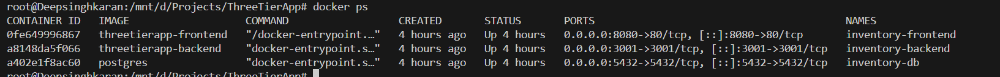

---

**Phase 7: Continuous Integration and Deployment (CI/CD) with GitHub Actions**

In this phase, a GitHub Actions workflow was created to automate the build, security scan, and deployment of the application. Whenever a developer pushes a commit to the main branch, the workflow is triggered. It first checks out the latest code from the repository and logs in to Docker Hub. Next, it builds both the backend and frontend Docker images and runs a Trivy scan to detect any vulnerabilities. Only when the scan reports zero vulnerabilities are the images automatically pushed to Docker Hub. This automation ensures a secure, consistent, and efficient CI/CD process for the application.

docker-ci.yml file

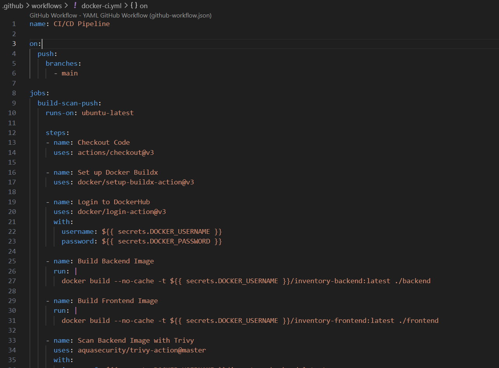

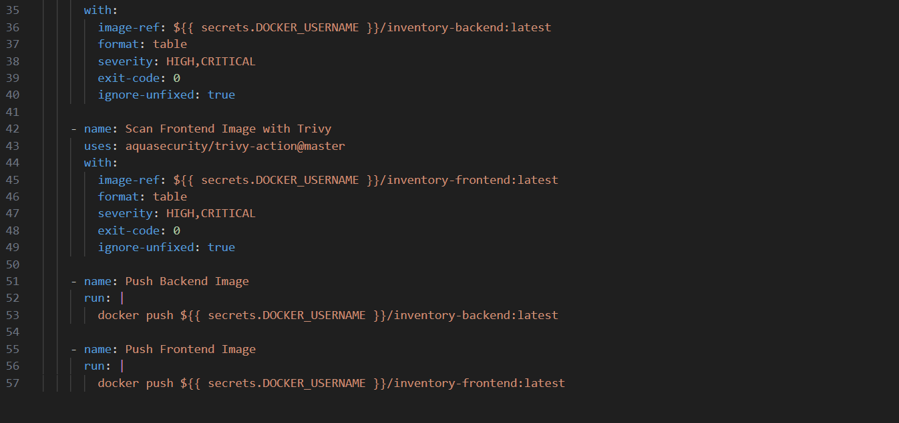

Step wise Step workflow

* **Workflow Name:** CI/CD Pipeline – Automates building, scanning, and pushing Docker images.
* **Trigger:** Runs on every push to the main branch.
* **Job:** build-scan-push runs on an ubuntu-latest runner.
* **Checkout Code:** Pulls the latest code from the repository using actions/checkout@v3.
* **Set up Docker Buildx:** Prepares the environment for building multi-platform Docker images.
* **Login to DockerHub:** Authenticates with Docker Hub using secrets (DOCKER_USERNAME and DOCKER_PASSWORD).
* **Build Backend Image:** Builds the backend Docker image without cache and tags it with the Docker Hub username.
* **Build Frontend Image:** Builds the frontend Docker image without cache and tags it similarly.
* **Scan Backend Image with Trivy:** Performs a security scan on the backend image, reporting HIGH and CRITICAL vulnerabilities, ignoring unfixed issues, and does not fail the workflow (exit-code: 0).
* **Scan Frontend Image with Trivy:** Performs the same security scan on the frontend image.
* **Push Backend Image:** Pushes the backend image to Docker Hub if the scan passes.
* **Push Frontend Image:** Pushes the frontend image to Docker Hub if the scan passes.

For security and best practices, Docker Hub credentials such as the username and password are stored in  **GitHub Repository Secrets** . These secrets are referenced in the GitHub Actions workflow, ensuring that sensitive information is never exposed in the code. By using repository secrets, the workflow can securely log in to Docker Hub to build and push Docker images without compromising credentials.

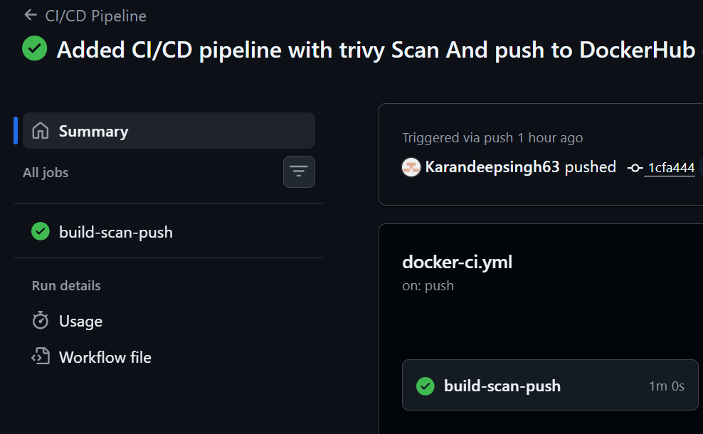

The screenshot confirms that your  **CI/CD pipeline ran successfully** , completing all tasks from building images, scanning them for vulnerabilities, and pushing them to Docker Hub. The workflow executed all steps in the correct order without errors, meaning your automated Docker build and deployment pipeline is fully functional.

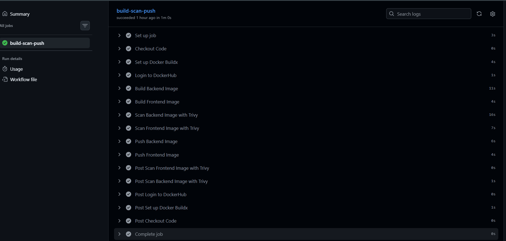

After the CI/CD workflow ran to completion, the pipeline successfully built and pushed Docker images for both the backend and frontend services to Docker Hub. This outcome demonstrates that the entire automation process—from code checkout, build, test, and containerization to deployment preparation—is functioning correctly. The images are now securely stored in Docker Hub, a centralized container registry, which ensures they can be reliably accessed and deployed across different environments, such as staging or production. By automating this process, we have minimized manual intervention, reduced the risk of human errors, and ensured consistent, reproducible deployments of the application. Additionally, having the images in a public registry enables easy scaling, versioning, and collaboration with other teams or services that depend on these containers.

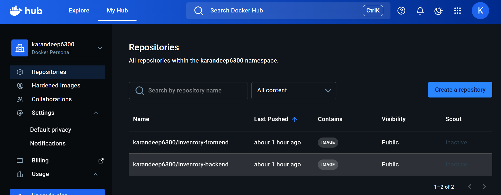

---

## Conclusion

This project demonstrates the implementation of a fully containerized three-tier inventory management application using Docker. By separating the frontend, backend, and database into individual containers, we ensured environment consistency, modularity, and easy scalability. The int

egration of Docker Compose simplified orchestration, while the CI/CD pipeline with GitHub Actions automated the build, security scanning, and deployment of Docker images to Docker Hub, ensuring secure and reproducible deployments.

Through this project, key concepts such as containerization, service communication, networking, automated testing, and DevOps best practices were applied in a real-world scenario. The completed application not only functions as an inventory management system but also serves as a strong demonstration of modern software development workflows, combining development, operations, and automation efficiently.
